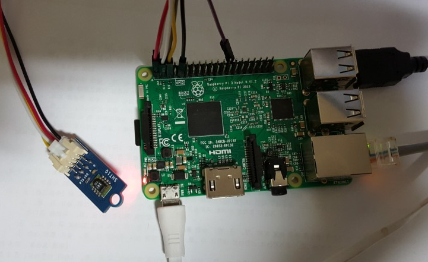
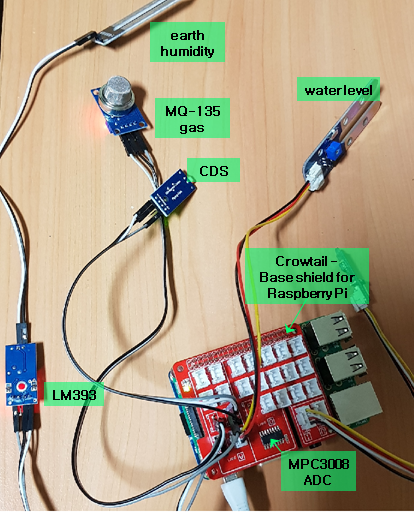

Green PET MQTT sensor data publisher
-----------------
Various sensor data are collected and published to MQTT broker.  
Running platform is Rasberry PI 3 model B with NOOBS.



Program run setup
---------------

```bash

# Install SHT10 python3 package
sudo pip3 install pi-sht1x

# install MQTT client library
sudo pip3 install paho-mqtt
```

Setup and use external ADC chip
---------------
- crowtail - Base shield for Raspberry Pi  
  
The original example python code from the shield manufacturer doesn't work.  
To get ADC value from MPC3008, the SPI read command should be changed.

Program run
---------------

```bash

# Edit line according to your MQTT broker address:
# "mqttLocalHost": "127.0.0.1",
vi mqttConfig.json

# run program
sudo python3 mqtt_loop_pub.py 1001 mqttConfig.json
```
